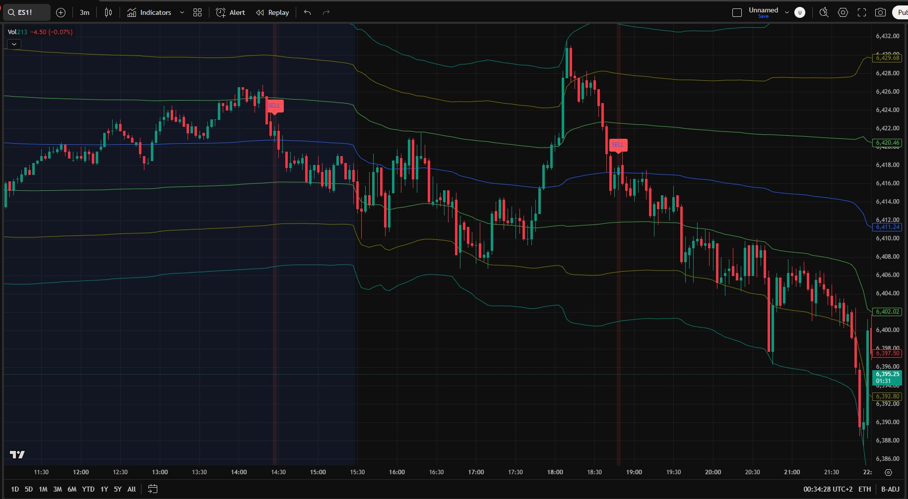

# EMA VWAP Early Sell Signal with Expanded Resistance

A **TradingView Pine Script** indicator for spotting **low-risk, high-reward short setups**.  
Best used on **3-minute candlesticks** for scalping, this tool combines **Exponential Moving Averages (EMAs)** with **VWAP (Volume Weighted Average Price)** and multiple resistance band levels to identify overextended conditions and early reversal opportunities.

⚠️ **Important**: Not recommended for use during **low-volume periods** or **algo-dominated trading sessions**, as signals may be unreliable in thin markets.

---

## 📸 Screenshot

---

## 📎 Direct TradingView Access
**https://www.tradingview.com/script/TUywCg1w-EMA-VWAP-Crossover-Sell-Signals/**

My TradingView profile: **[EmotionalTrader777](https://www.tradingview.com/u/EmotionalTrader777/)**

---

## ✨ Features
- **Optimized for Scalping**:
  - Designed for fast-paced intraday trading on 3-minute charts.
- **EMA Crossunder Detection**:
  - Configurable fast and slow EMAs to identify bearish momentum shifts.
- **VWAP Resistance Zones**:
  - Three dynamic upper bands calculated using Standard Deviation or Percentage.
- **Signal Classification**:
  - Different shades of red to indicate severity of overextension.
- **Stop-Loss Alerts**:
  - Marks “WRONG” if the trade moves against you beyond a set amount.
- **Customizable Parameters**:
  - EMA lengths, VWAP anchor, band multipliers, and calculation mode.

---

## 🛠 How It Works
1. **EMA Crossunder** — Fast EMA crosses below Slow EMA = potential bearish reversal.
2. **Resistance Zone Check** — Price must be at or above VWAP, near defined resistance bands.
3. **Signal Classification**:
   - **Band 1–2** = mild overextension, early warning.
   - **Band 2–3** = stronger overextension, higher conviction.
   - **Above Band 3** = extreme overextension, highest conviction.
4. **Stop-Loss Marking**:
   - If price rallies by a set amount after a signal, label as “WRONG” for review.

---

## ⚡ Use Cases
- **Scalping short entries** during intraday reversals.
- **Taking profits** on long positions at potential exhaustion points.
- Filtering trades with both **trend (EMA)** and **mean reversion (VWAP)** signals.

---

## 📋 Inputs
| Input                       | Description                                   | Default |
|-----------------------------|-----------------------------------------------|---------|
| EMA Length 1                | Fast EMA length                               | 9       |
| EMA Length 2                | Slow EMA length                               | 21      |
| Anchor Period                | VWAP reset period (Session/Week/Month)       | Session |
| Bands Calculation Mode       | Standard Deviation or Percentage             | SD      |
| Band Multipliers (#1, #2, #3)| Resistance zone distance multipliers         | 1, 2, 3 |

---

## 📦 Installation
1. Copy the code from `EMA-VWAP-Early-Sell-Signal.pine`
2. Open **TradingView**
3. Go to **Pine Editor**
4. Paste the code and click **Add to Chart**
5. Save the script to your account

---

## 📜 License
MIT License — free to use, modify, and share.

---

## 👤 Author
**EmotionalTrader**  
- Futures trader, Python learner, aspiring asset trader, horse whisperer, space cowboy  
- [TradingView Profile](https://www.tradingview.com/u/EmotionalTrader777/)  
- [GitHub](https://github.com/EmotionalTrader)
